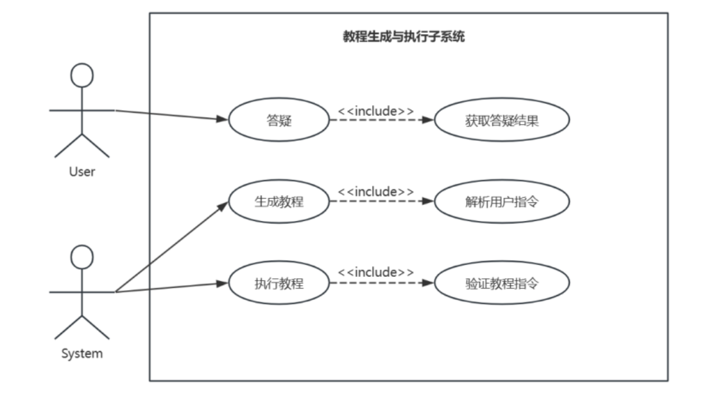

# AgeMate——基于大模型的老年人电脑助手项目文档

## 1. 需求分析

### 1.1 引言

#### 1.1.1 项目背景

AgeMate 主要服务于老年人群体，特别是那些不熟悉或不擅长使用电脑的老年用户。原因如下：

**人口老龄化趋势：** 随着我国逐渐步入深度老龄化社会，老年人口比例不断上升。截至 2021 年 12 月，我国 60 岁及以上老年网民规模已达 1.19 亿，且仍在持续增长。

**数字鸿沟问题：** 老年人群体在逐渐壮大，随之而来的是他们在使用互联网方面面临着诸多挑战。操作复杂、界面不友好、功能繁多、学习成本高等问题，使得老年人难以适应和使用电脑。

**政策支持：** 国家自 2020 年起推进互联网应用适老化改造，并制定了相关标准和规范，积极鼓励和支持为老年人群体提供更友好的互联网和移动应用服务。

AgeMate 项目面向使用电脑的老年人群体，通过为老年人提供智能、便捷的电脑助手服务，旨在提升老年人的生活质量，增强他们的生活独立性，帮助老年人面对数字鸿沟问题。

#### 1.1.2 项目目标

本项目的目标是开发一个基于大模型的老年人电脑助手 AgeMate，帮助老年人快速掌握电脑操作，提高老年人的生活质量。AgeMate 的实时教程生成教程能力可以弥补部分网页的众包教程难以理解、不够细化的缺陷，让老年人在网页上随时随处可问。

#### 1.1.3 项目范围

##### 1.1.3.1 包含的内容

- 本项目为老年人提供一个网页端的解决方案，支持 Windows、MacOS、Linux 操作系统上的 Chrome 浏览器。
- 本项目支持在交互中完成教程，给老年人可视化的反馈。
- 本项目支持在教程结束后查看图文指导书。

##### 1.1.3.2 不包含的内容

- 本项目不支持其他主流浏览器，如 Microsoft Edge, Apple Safari。

### 1.2 需求概述

#### 1.2.1 功能性需求

- 用户可以登录、注册、管理个人信息。
- 管理员可以查看并管理用户信息。
- 用户可以通过语音和文字向系统提出问题。
- 系统能够以可视化的方式，在应该操作的位置附近给予用户提示。
- 用户可以在教程生成和执行的全过程中与系统交互。
- 用户有最高决策权，可以决定是否接受系统给出的教程，并可以随时终止教程。
- 用户在教程执行时能够不受影响地自主与页面进行其他交互。
- 用户可以查看图文指导书。

#### 1.2.2 非功能性需求

- 响应速度：每两次教程渲染到页面的时间间隔不超过 10s。
- 安全性：用户鉴权通过后才能在系统中执行操作。
- 并发性：系统能够同时为多个用户执行教程。
- 兼容性：系统能够兼容 Windows、MacOS、Linux 操作系统上的 Chrome 浏览器。

### 1.3. 用例

用例将 AgeMate 分为三个子系统，分别是：用户管理子系统、教程生成与执行子系统、日志子系统。这三个子系统宏观地描述了 AgeMate 的功能性需求，但微服务并不严格按照这三个子系统进行划分。

#### 1.3.1 用户管理子系统

在用户管理子系统中，主要应当完成以下功能需求：

1. 用户登录：用户输入用户名和密码进行登录，系统验证用户信息并返回登录成功信息。如果用户输入错误信息，系统返回错误信息。
2. 用户注册：用户输入注册信息进行注册，系统验证注册信息并返回注册成功信息。如果用户输入错误信息，系统返回错误信息。
3. 管理用户：管理员对用户进行管理，包括查看、修改和删除用户信息。管理员需要验证管理权限。
   

1.注册用例需求分析

| **名称**       | 注册                     |
| -------------- | ------------------------ |
| **编号**       | UC-001                   |
| **简述**       | 用户输入注册信息进行注册 |
| **执行者**     | Visitor                  |
| **频度**       | 中                       |
| **状态**       | 通过审查                 |
| **前置条件**   | 无                       |
| **基本事件流** | 1. 用户输入注册信息      |
|                | 2. 系统验证注册信息      |
|                | 3. 系统返回注册成功信息  |
| **扩展事件流** | 1a. 用户输入错误信息     |
|                | 1b. 系统返回错误信息     |
| **后置条件**   | 用户成功注册，成为 User  |

用户注册的状态转换如下图所示:

2.登录用例需求分析
| **名称** | 登录 |
| -------------- | ---------------------------- |
| **编号** | UC-002 |
| **简述** | 用户输入用户名和密码进行登录 |
| **执行者** | Visitor |
| **频度** | 高 |
| **状态** | 通过审查 |
| **前置条件** | 无 |
| **基本事件流** | 1. 用户输入用户名和密码 |
| | 2. 系统验证用户信息 |
| | 3. 系统返回登录成功信息 |
| **扩展事件流** | 1a. 用户输入错误信息 |
| | 1b. 系统返回错误信息 |
| **后置条件** | 用户成功登录，成为 User |

用户登录的状态转换如下图所示:

3.管理员管理用例需求分析

| **名称**       | 管理用户                  |
| -------------- | ------------------------- |
| **编号**       | UC-003                    |
| **简述**       | 管理员对用户进行管理      |
| **执行者**     | Admin                     |
| **频度**       | 低                        |
| **状态**       | 通过审查                  |
| **前置条件**   | 管理员已登录              |
| **基本事件流** | 1. 管理员选择管理用户     |
|                | 2. 管理员进行用户管理操作 |
|                | 3. 系统保存管理结果       |
| **扩展事件流** | 无                        |
| **后置条件**   | 管理员成功管理用户        |

管理员管理用户的状态转换如下图所示:

#### 1.3.2 教程生成与执行子系统

在教程生成与执行子系统中，主要应当完成以下功能需求：

1. 答疑：用户提出问题，系统返回答疑结果。
2. 生成教程：系统根据用户指令生成教程。
3. 执行教程：系统执行教程。

1.答疑需求分析
| **名称** | 答疑 |
|----------------|-----------------------------------|
| **编号** | UC-004 |
| **简述** | 用户提出问题并得到答疑结果 |
| **执行者** | User |
| **频度** | 高 |
| **状态** | 通过审查 |
| **前置条件** | 用户已登录 |
| **基本事件流** | 1. 用户提出问题 |
| | 2. 系统返回答疑结果 |
| **扩展事件流** | 无 |
| **后置条件** | 用户得到答疑结果 |

2.生成教程需求分析

| **名称**       | 生成教程                 |
| -------------- | ------------------------ |
| **编号**       | UC-005                   |
| **简述**       | 系统根据用户指令生成教程 |
| **执行者**     | System                   |
| **频度**       | 高                       |
| **状态**       | 通过审查                 |
| **前置条件**   | 用户已登录               |
| **基本事件流** | 1. 用户输入指令          |
|                | 2. 系统生成教程          |
| **扩展事件流** | 无                       |
| **后置条件**   | 系统成功生成教程         |

系统生成教程的状态转换如下图所示:

3.执行教程需求分析

| **名称**       | 执行教程            |
| -------------- | ------------------- |
| **编号**       | UC-012              |
| **简述**       | 系统执行教程        |
| **执行者**     | System              |
| **频度**       | 高                  |
| **状态**       | 通过审查            |
| **前置条件**   | 用户已登录          |
| **基本事件流** | 1. 系统接收教程指令 |
|                | 2. 系统执行教程     |
| **扩展事件流** | 无                  |
| **后置条件**   | 系统成功执行教程    |

系统执行教程的状态转换如下图所示:

#### 1.3.3 日志子系统

在日志子系统中，主要应当完成以下功能需求：

1. 保存日志：系统记录用户操作并保存日志。
2. 生成指导书：系统根据用户操作生成指导书并保存。

1.保存日志需求分析

| **名称**       | 保存日志                   |
| -------------- | -------------------------- |
| **编号**       | UC-013                     |
| **简述**       | 系统记录用户操作并保存日志 |
| **执行者**     | System                     |
| **频度**       | 高                         |
| **状态**       | 通过审查                   |
| **前置条件**   | 用户已登录                 |
| **基本事件流** | 1. 系统记录用户操作        |
|                | 2. 系统保存日志            |
| **扩展事件流** | 无                         |
| **后置条件**   | 系统成功保存日志           |

系统保存日志的状态转换如下图所示:

2.生成指导书需求分析

| **名称**       | 生成指导书                    |
| -------------- | ----------------------------- |
| **编号**       | UC-014                        |
| **简述**       | 系统根据用户操作生成指导书    |
| **执行者**     | System                        |
| **频度**       | 中                            |
| **状态**       | 通过审查                      |
| **前置条件**   | 用户已登录                    |
| **基本事件流** | 1. 系统根据用户操作生成指导书 |
|                | 2. 系统保存指导书             |
| **扩展事件流** | 无                            |
| **后置条件**   | 系统成功生成指导书            |

系统生成指导书的状态转换如下图所示:

## 2. 系统设计
### 2.1 系统架构

## 3. 架构描述
